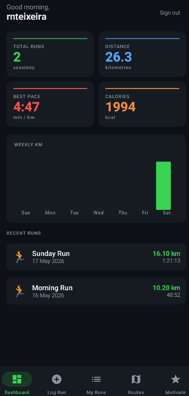
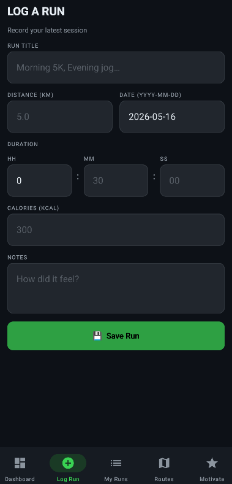
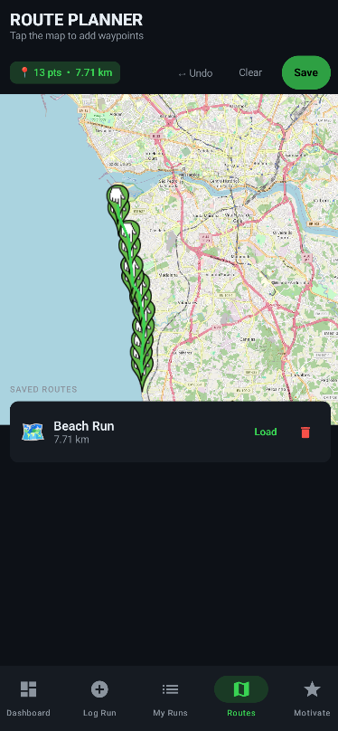
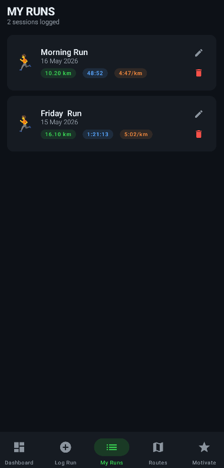
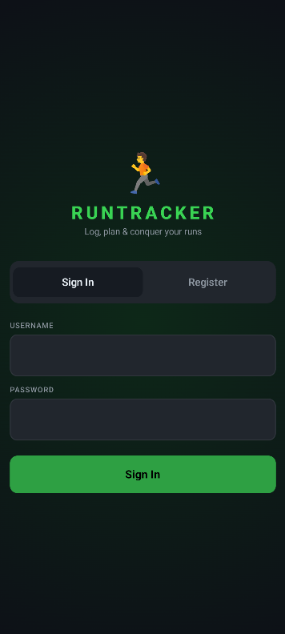
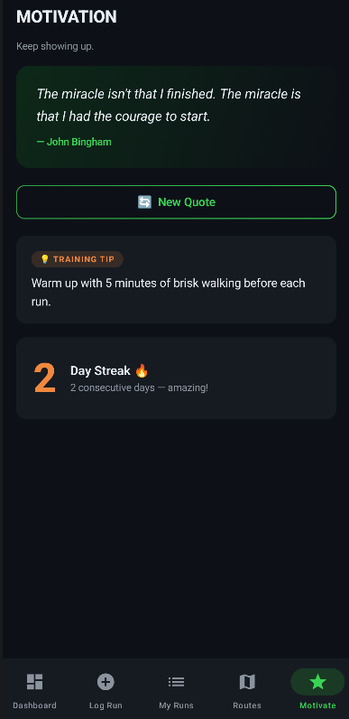

# RunTracker 🏃‍♂️

RunTracker is a modern Android application built with Kotlin and Jetpack Compose, designed to help runners log their sessions, plan routes and track their progress over time.

## ✨ Features

- **Personalized Dashboard**: Get a quick overview of your running stats, including total runs, total distance, best pace, and calories burned.
- **Weekly Progress Chart**: Visualize your weekly running distance with an interactive bar chart.



- **Run Logging**: Manually log your runs with details like title, distance, duration, calories, and personal notes.



- **Route Planner**: Plan your future runs using the integrated OpenStreetMap (OSMDroid). Tap to add waypoints and automatically calculate the route distance.



- **Recent Activities**: Quickly view your most recent runs directly from the dashboard.



- **Secure Authentication**: User-based login and registration to keep your running data private.



- **Motivation**: Stay inspired with a dedicated motivation screen.



- **Dark Mode Support**: Styled with a sleek dark theme for better visibility and reduced eye strain.

## 📁 Project Structure

```text
app/src/main/kotlin/com/runtracker/
├── data/           # Data layer (Room entities, DAOs, repositories)
├── di/             # Hilt modules for dependency injection
├── ui/
│   ├── components/ # Reusable UI components
│   ├── screens/    # Individual screens (Dashboard, Auth, LogRun, Routes, etc.)
│   └── theme/      # Compose theme and color definitions
├── MainActivity.kt # Entry point of the app
└── RunTrackerApp.kt# Hilt Application class
```

## 🚀 Getting Started

### Prerequisites

- Android Studio Jellyfish or newer.
- Android SDK 26+ (Android 8.0+).

### Installation

1. Clone the repository:
   ```bash
   git clone https://github.com/your-username/RunTracker.git
   ```
2. Open the project in Android Studio.
3. Sync the project with Gradle files.
4. Run the app on an emulator or a physical device.

## 📄 License

MIT - personal use, fork freely.
